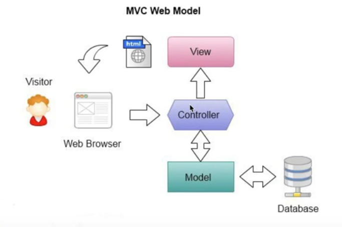
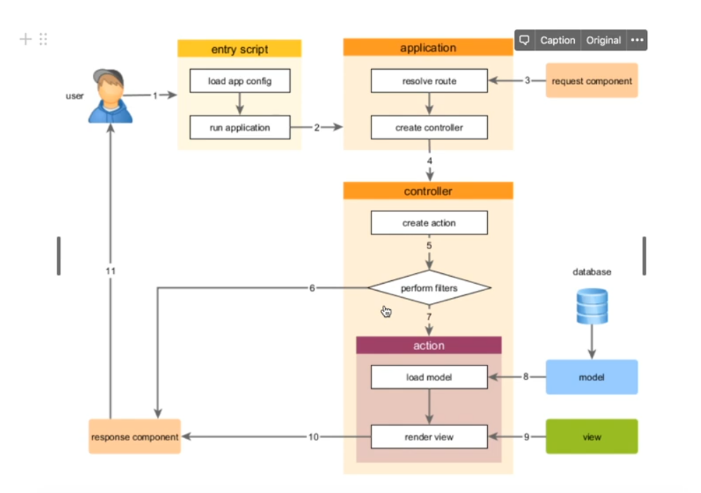

<p align="center">
    <a href="https://github.com/yiisoft" target="_blank">
        
    </a>
    <h1 align="center">Yii 2 Advanced Project Template</h1>
    <br>
</p>

Yii 2 Advanced Project Template is a skeleton [Yii 2](https://www.yiiframework.com/) application best for
developing complex Web applications with multiple tiers.

The template includes three tiers: front end, back end, and console, each of which
is a separate Yii application.

The template is designed to work in a team development environment. It supports
deploying the application in different environments.

Documentation is at [docs/guide/README.md](docs/guide/README.md).

[](https://packagist.org/packages/yiisoft/yii2-app-advanced)
[](https://packagist.org/packages/yiisoft/yii2-app-advanced)
[](https://github.com/yiisoft/yii2-app-advanced/actions?query=workflow%3Abuild)

DIRECTORY STRUCTURE
-------------------

```
common
    config/              contains shared configurations
    mail/                contains view files for e-mails
    models/              contains model classes used in both backend and frontend
    tests/               contains tests for common classes    
console
    config/              contains console configurations
    controllers/         contains console controllers (commands)
    migrations/          contains database migrations
    models/              contains console-specific model classes
    runtime/             contains files generated during runtime
backend
    assets/              contains application assets such as JavaScript and CSS
    config/              contains backend configurations
    controllers/         contains Web controller classes
    models/              contains backend-specific model classes
    runtime/             contains files generated during runtime
    tests/               contains tests for backend application    
    views/               contains view files for the Web application
    web/                 contains the entry script and Web resources
frontend
    assets/              contains application assets such as JavaScript and CSS
    config/              contains frontend configurations
    controllers/         contains Web controller classes
    models/              contains frontend-specific model classes
    runtime/             contains files generated during runtime
    tests/               contains tests for frontend application
    views/               contains view files for the Web application
    web/                 contains the entry script and Web resources
    widgets/             contains frontend widgets
vendor/                  contains dependent 3rd-party packages
environments/            contains environment-based overrides
```

### Installing using Composer

```bash
composer create-project --prefer-dist yiisoft/yii2-app-advanced yii-application
```

### Settings

```bash
php init
```

0 -> yes

common/config/main-local.php

```bash
./yii migrate
```

```bash
sudo nano /etc/hosts
```

```
127.0.0.1      application.local
127.0.0.1      admin.application.local
```

```bash
cd /etc/apache2/sites-available/
ls
sudo nano application.conf
```

```apacheconf
<VirtualHost *:80>
    ServerName application.local
    DocumentRoot /home/rovshen/PhpstormProjects/yii-application/frontend/web

    <Directory /home/rovshen/PhpstormProjects/yii-application/frontend/web>
        Options Indexes FollowSymLinks
        AllowOverride All
        Require all granted
    </Directory>

    ErrorLog ${APACHE_LOG_DIR}/admin.anjumanlar.local_error.log
    CustomLog ${APACHE_LOG_DIR}/admin.anjumanlar.local_access.log combined
</VirtualHost>
```

Ctrl + O -> Enter -> Ctrl + X

```bash
sudo cp application.conf admin.application.conf
sudo nano admin.application.conf
```

```apacheconf
<VirtualHost *:80>
    ServerName admin.application.local
    DocumentRoot /home/rovshen/PhpstormProjects/yii-application/backend/web

    <Directory /home/rovshen/PhpstormProjects/yii-application/backend/web>
        Options Indexes FollowSymLinks
        AllowOverride All
        Require all granted
    </Directory>

    ErrorLog ${APACHE_LOG_DIR}/admin.anjumanlar.local_error.log
    CustomLog ${APACHE_LOG_DIR}/admin.anjumanlar.local_access.log combined
</VirtualHost>
```

Ctrl + O -> Enter -> Ctrl + X

```bash
sudo a2ensite application
sudo a2ensite admin.application
sudo systemctl reload apache2
```

Yii2 works with MVC





### Application, Controller and Action

http://application.local/index.php?r=post%2Fhello

http://application.local/index.php?r=ControllerID%2FActionID


http://application.local/post/hello

http://application.local/ControllerID/ActionID

### Model. Validators

[Yii Validators](https://www.yiiframework.com/doc/guide/2.0/en/tutorial-core-validators)

### Works with Forms. ActiveForm

```sql
CREATE TABLE person(
    id BIGSERIAL NOT NULL PRIMARY KEY,
    first_name VARCHAR(50),
    last_name VARCHAR(50),
    email VARCHAR(50),
    gender VARCHAR(10)
);
```
